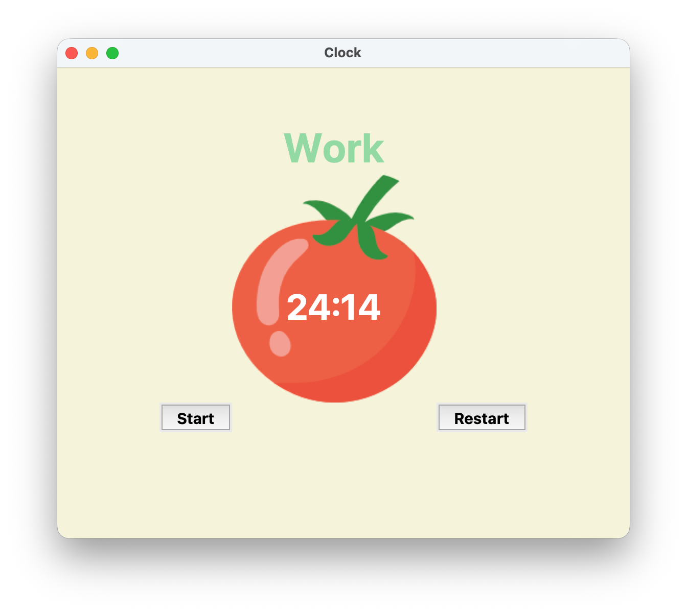

# Pomodoro Timer

A desktop Pomodoro Timer application built with Python and the Tkinter GUI library. This tool helps users manage their time and boost productivity by breaking down work into focused intervals, separated by short breaks.

## Demo



## Features

-   **Classic Pomodoro Technique:** The timer cycles through 25-minute work sessions and 5-minute short breaks.
-   **Long Breaks:** After four work sessions (reps), a longer 20-minute break is automatically started.
-   **Visual Interface:** A clean and simple GUI built with Tkinter, featuring a tomato image that visually counts down the time.
-   **Progress Tracking:** Checkmarks are added at the bottom of the window to visually track the number of completed work sessions.
-   **Start & Reset Functionality:** Users can start, reset, and cycle through the timer sessions with intuitive button controls.

## Project Setup

To run this project locally, follow these steps.

### Prerequisites

-   Python 3.x (Tkinter is included with most standard Python installations).

### Installation

1.  **Clone the repository to your local machine:**
    ```bash
    git clone https://github.com/dheerajdhami2001-cyber/pomodoro_timer.git
    ```

2.  **Navigate into the project directory:**
    ```bash
    cd pomodoro_timer
    ```

3.  **Run the application:**
    ```bash
    python main.py
    ```

## Code Overview

-   **`main.py`**: This single script contains the entire application logic.
    -   **Constants:** Defines timer intervals and color schemes.
    -   **Timer Mechanism:** Manages the logic for cycling between work, short break, and long break sessions.
    -   **Countdown Mechanism:** Handles the on-screen countdown using `window.after()`.
    -   **UI Setup:** Constructs the graphical user interface using Tkinter widgets like `Canvas`, `Label`, and `Button`.

## Acknowledgments

This project was inspired by and completed with the guidance of the **[100 Days of Code: The Complete Python Pro Bootcamp](https://www.udemy.com/course/100-days-of-code/)** by Dr. Angela Yu.
